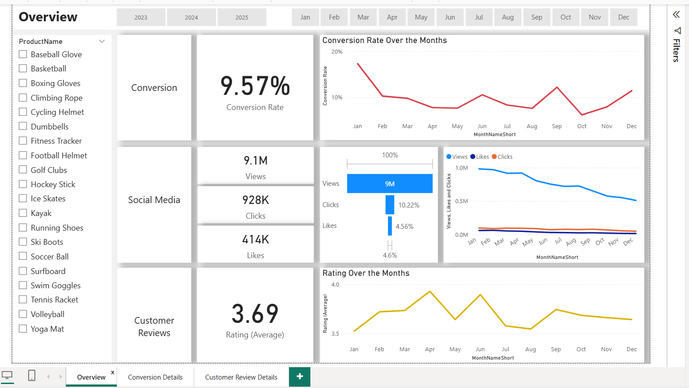
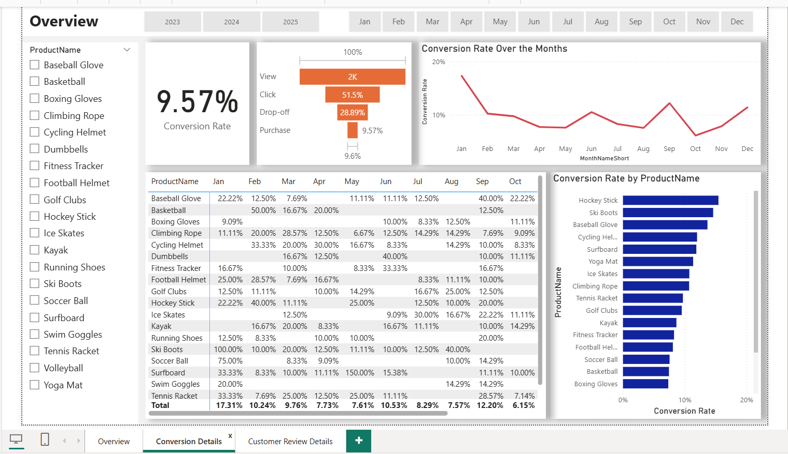
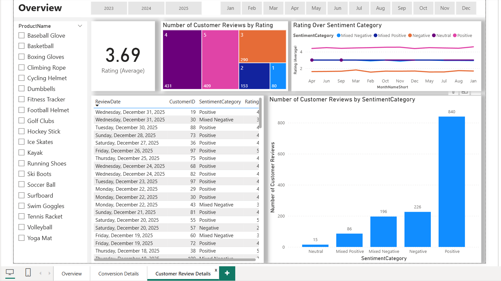

# 📊 Marketing Analytics Portfolio Project

This project showcases a full-cycle marketing analytics workflow using **SQL, Python**, and **Power BI**. It focuses on understanding customer behavior, analyzing campaign effectiveness, and uncovering patterns in customer feedback through **sentiment analysis**.
---

---

## 🔍 Project Overview

This case study analyzes marketing performance across product lines and content channels over one year. It identifies key challenges such as:

- 🔻 Decreased **conversion rates**
- 📉 Reduced **customer engagement**
- 💬 Mixed **customer feedback and ratings**

It also provides **data-driven recommendations** for boosting engagement, conversions, and satisfaction.

---

## ⚙️ Tools & Technologies Used

| Tool       | Purpose                                     |
|------------|---------------------------------------------|
| **SQL**    | Data cleaning, transformation, and querying |
| **Python** | Customer review sentiment analysis          |
| **Power BI** | Interactive data visualization             |

---

## 📑 Data Sources

- Marketing campaign performance data (views, clicks, likes)
- Product conversion statistics
- Customer reviews and star ratings

---

## 📉 Key Business Insights

### 🔺 Conversion Rates
- **Highest Month:** January (18.5%), led by Ski Boots with 150% conversion
- **Lowest Month:** May (4.3%), with no standout products
- **Trend Insight:** Peaks in February and July indicate strong seasonality

### 📣 Customer Engagement
- Views peaked in **February** and **July**, then declined
- Clicks and likes were consistently low, indicating weak CTAs or content fatigue
- **Blogs** performed best in April and July, outperforming videos and social media posts

### 💬 Customer Feedback
- **Average Rating:** 3.7 out of 5 (below 4.0 target)
- 275 reviews were positive, 82 negative
- Low-rated products (< 3.5) signal specific areas needing improvement

---

## 🧠 Sentiment Analysis with Python 🐍

Using **Python and the NLTK VADER** sentiment analyzer, we processed textual reviews to classify customer feedback into:

- ✅ Positive
- ❌ Negative
- ⚖️ Neutral / Mixed

**Results:**
- 275 reviews were classified as **positive**
- 82 as **negative**
- Remaining were **neutral or mixed sentiment**

**Insight:** Although most reviews are favorable, the mixed and negative feedback reveals pain points in product experience and support. Addressing these can shift overall satisfaction upward.

---

## 🎯 Goals & Strategic Recommendations

| Goal                        | Action Plan                                                                 |
|-----------------------------|------------------------------------------------------------------------------|
| 📈 Improve Conversion Rates | Target top-performing categories in seasonal campaigns (e.g., Jan, Sep)     |
| 📣 Boost Engagement         | Optimize CTAs and shift to more engaging formats (e.g., interactive videos) |
| 🌟 Increase Ratings         | Follow up on mixed/negative reviews, implement product improvements          |

---

## 📊 Dashboard Preview

---

---

## 📌 Summary

This portfolio project demonstrates how to combine SQL, Python, and Power BI in a real-world marketing scenario. From cleaning and querying data to running sentiment analysis and presenting insights visually, it delivers a full data-to-decision pipeline.

